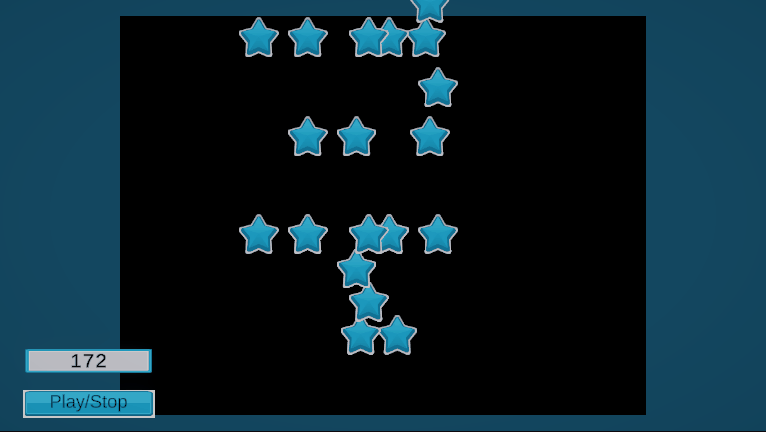

### Welcome to my prototype of camera view and midi integration for Unity 👋

<!-- ABOUT THE PROJECT -->
## About The Project

This project has the objective of making a game working with a camera view controller and midi file integration for music.
The game itself is about collecting all the stars falling from the music playing.

## Setup

To make it work you just need to have a webcam plug, launch the project and click on the play button.
If needed, the game can be paused by clicking on the same button.
