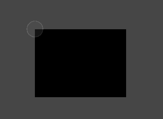
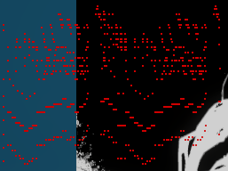

### Welcome to my prototype of camera view and midi integration for Unity 👋

<!-- ABOUT THE PROJECT -->
## About The Project

This project has the objective of making a game working with a camera view controller and midi file integration for music.
The game itself is about collecting all the stars falling from the music playing.

## Setup

To make it work you just need to have a webcam plug, launch the project and click on the play button.
If needed, the game can be paused by clicking on the same button.

## Work

To make this project work, I used the "OpenCV Plus Unity" in the Unity store. This allowed me to get a texture from a webcam that I put on a raw image and change some lines to make it stay the right size of it. 
Next on that, I used the functions in this package to change the image color, get the contrasts, get the outline and the points to make it. With that i drew the outlines and used a polygon collider to make the collider following the outline.

After that i used the "Maestro - Midi Player Tool Kit" to allow me to play some midi files on the project. I used it to get information on the music played and make the falling stars fall from the notes played.

  
(Example of debug vision of the notes playing during play)
